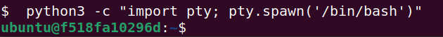

# Try Hack Me Writeup - Intermediate Nmap
- TryHackMe room: <https://tryhackme.com/room/intermediatenmap>
- OS: `Linux (Ubuntu)`

You've learned some great nmap skills! Now can you combine that with other skills with netcat and protocols, to log in to this machine and find the flag? This VM 10.10.206.67 is listening on a high port, and if you connect to it it may give you some information you can use to connect to a lower port commonly used for remote access!

The only task is to capture the flag:

## Enumeration ports and services 
nmap [ip_Addr] -p- -A 
-p-: To scan all ports 
-A:  For aggressive scanning

We have ssh service on both port 22 and 2222, But we are intressted in the port 31337

## Check web server
Type 10.10.206.67:31337 in your web browser, we land on a page that contains login credentials. 

## SSH-Login
ssh (found_user)@10.10.206.67
enter the password, and we are in

to spawn a more interactive shell:
python3 -c "import pty; pty.spawn('/bin/bash')"

## Get the flag
We have the permission to read the flag

